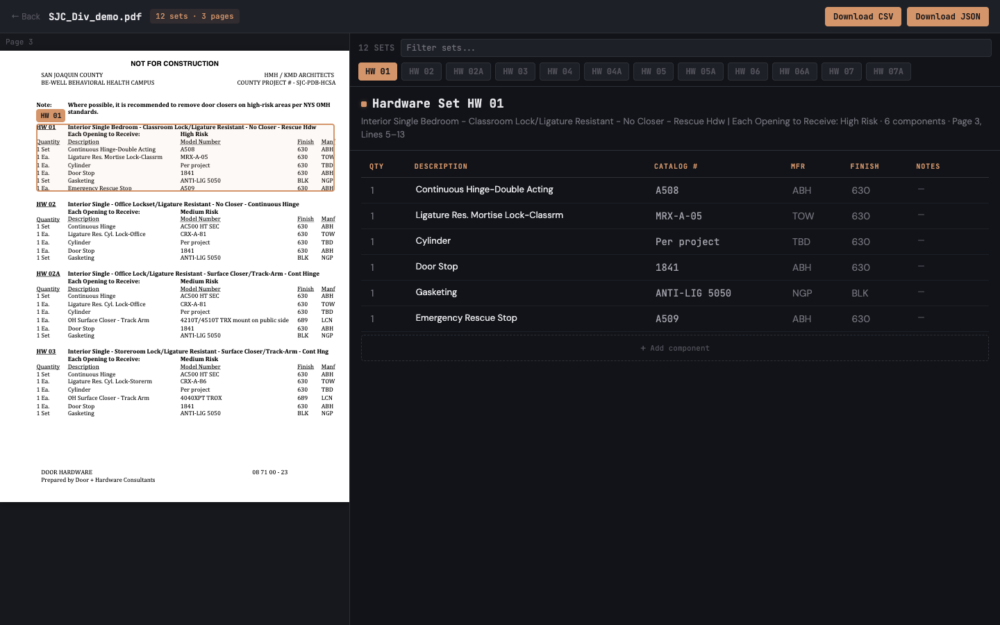

# Hardware Sets — Division 08 Specbook Extractor

Extracts every door-hardware set from a construction Division 08 (Openings)
specbook PDF into structured JSON, including the page and bounding box where
each set lives.

**Live demo:** https://fresco-challenge.fly.dev



## Stack

- **Extractor:** Python 3.12, pdfplumber, Anthropic SDK
- **API:** FastAPI + uvicorn
- **Frontend:** React 19, TypeScript, Vite, Tailwind v4
- **Deploy:** Docker (multi-stage) → Fly.io

## How It Works

The pipeline runs in three sequential stages:

**Filter (`filter.py`)** scans every page with regex patterns to identify the
contiguous pages containing the hardware schedule — skipping architectural
drawings, structural specs, and boilerplate. It handles section-list and
tabular formats, multi-page sets, and `NOT USED` sets.

**Layout (`layout.py`)** renders each schedule page as a numbered list of
lines with bounding boxes using pdfplumber. Line numbers give Claude a stable
addressing scheme to cite set locations (`line_range: [4, 12]`), and bboxes
let the frontend draw overlays directly on the rendered PDF.

**Extract (`extract.py`)** sends the numbered text to Claude via forced tool
use — a strict JSON schema that guarantees structured output and explicit
`null`s for missing fields. Returns `HardwareSet` objects with `set_number`,
`description`, `components[]`, and `line_range`, which the pipeline resolves
to pixel-level bboxes.

## Design Decisions

**pdfplumber over pdftotext** — The original implementation used
`pdftotext -layout` (Poppler), which produces readable text but discards
geometry. Switching to pdfplumber preserves word-level `(x0, top, x1,
bottom)` coordinates, making bboxes a first-class output rather than a
post-hoc approximation.

**Mfr vs. finish resolution** — Short codes like `PE` (Pemko or Painted
Enamel) and `NO` (Norton or "No") are ambiguous in isolation. The pipeline
passes full column context to Claude — surrounding values like `MK`, `LCN`,
`SCH` identify a manufacturer column; `US26D`, `630`, `BSP` identify a finish
column — so the model resolves codes from context, not per-cell guessing.

**Sonnet over Haiku** — Haiku is ~8x cheaper but produces more column
misattribution errors on ambiguous codes, particularly in tabular schedules
with inconsistent layouts. Sonnet's accuracy on structure-heavy extraction
justifies the cost (see Accuracy below).

## Accuracy

Evaluated against manually verified ground truth across 3 demo specbooks
covering both tabular schedules and section-list formats (26 sets, 157
components, 780 fields):

| Model | Field-level accuracy | Qty | Description | Catalog # | Mfr | Finish |
|---|---|---|---|---|---|---|
| **Sonnet 4.6** | **97.1%** (757/780) | 100% | 96.8% | 93.6% | 97.4% | 97.4% |
| Haiku 4.5 | 82.9% (647/780) | 100% | 49.4% | 78.8% | 94.2% | 92.3% |

Sonnet's 14-point advantage concentrates in the hardest parts of the problem:
description boundary parsing, catalog number completeness, and mfr/finish
column disambiguation. Haiku's remaining errors include prepending quantity
units into descriptions, truncating catalog suffixes, and swapping mfr/finish
codes — exactly the ambiguous-code resolution the challenge calls out.

Sonnet's 23 residual errors fall into two categories: an OCR-like misread
(`LEVER` → `LEVEL` in a tabular layout, 4 errors) and struck-through content
that pdfplumber cannot detect (14 errors cascading across two sets).

## Setup

Requires Python 3.12+ and Node 18+.

```bash
python -m venv .venv
source .venv/bin/activate
pip install -e ".[dev]"
```

Create `.env.local` with your Anthropic API key (this file is gitignored):

```bash
ANTHROPIC_API_KEY=sk-ant-...
```

### CLI

```bash
export $(grep -v '^#' .env.local | xargs)
python -m hardware_sets path/to/specbook.pdf --out result.json
```

### Local dev (API + frontend)

```bash
# API (loads key from .env.local)
export $(grep -v '^#' .env.local | xargs) && uvicorn hardware_sets_api.app:app --reload

# Frontend (separate terminal)
cd frontend && npm install && npm run dev
```

### Docker

```bash
docker build -t hardware-sets .
docker run -p 8000:8000 -e ANTHROPIC_API_KEY=sk-ant-... hardware-sets
```

## Tests

```bash
pytest
```

Covers filter pattern matching, layout line clustering, bbox attachment, and
API behavior. End-to-end extraction accuracy is validated against ground truth
in `demo_samples/ground_truth/`:

```bash
# Re-run accuracy audit (uses cached extractions by default; --extract for fresh)
python scripts/accuracy_audit.py
```
